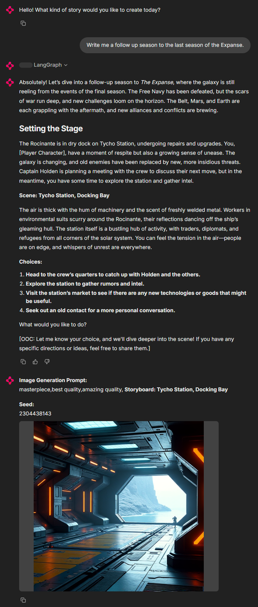

# Dreamdeck: Your AI-Powered Storytelling Companion

Dreamdeck is an AI-powered application designed to provide a Holodeck-like experience, enabling you to create and manage immersive, collaborative stories. Whether you're a game master (GM) or a player, Dreamdeck will guide you through dynamic and engaging narratives, generate vivid storyboards, and store all your data locally for safety and accessibility.

## New Features

- **Smart Categorization of User Input:**
  - The app now categorizes user input into different buckets to handle specific actions:
    - **Roll:** If the user wants to roll dice, the app will handle the roll before continuing the story.
    - **Search:** If the user wants to look up information, the app will perform a web search using SerpAPI.
    - **Continue Story:** If the user is continuing the story, the app will generate the next part of the narrative.

## Features

- **Immersive Narratives:** The AI Game Master (GM) creates detailed, character-driven stories that adapt to your choices and preferences.
- **Vivid Storyboards:** Generate visual storyboards to bring your narrative to life.
- **Local Storage:** All your stories, characters, and elements are stored locally.
- **Multi-Language Support:** Enjoy the app in multiple languages, including English, Bengali, Gujarati, Hebrew, Hindi, Kannada, Malayalam, Marathi, Dutch, Tamil, Telugu, and Chinese (Simplified).
- **Flexible Tone:** The GM can adapt to your preferred tone, whether it's lighthearted, serious, or intense.
- **Rich Descriptions:** The GM paints vivid environments, distinct cultures, and believable characters.
- **Adaptation and Improvisation:** The GM uses "Yes, and…" or "Yes, but…" techniques to incorporate new ideas and evolve the plot organically.
- **Clear Decision Points:** The GM presents meaningful choices that impact the story's direction.
- **Neutral Ethical Stance:** The GM remains ethically neutral, responding to your direction without imposing bias.
- **Dice Roll Tool:** Add an element of chance to your game with the `/roll` command.
- **Knowledge Management:** Load and use knowledge documents to enrich the narrative.



## Getting Started

### Prerequisites

- Python 3.8+
- Docker
- Poetry (for dependency management)

### Installation

1. **Clone the Repository:**
   ```sh
   git clone <repository-url>
   cd dreamdeck
   ```

2. **Install Dependencies:**
   ```sh
   make install
   ```

3. **Start the Application:**
   - **Locally:**
     ```sh
     make run
     ```
     Access the app at `http://localhost:8081`.
   - **With Docker:**
     ```sh
     make start
     ```
     Access the app at `http://localhost:8080`.

### Development

- **Run the App Locally:**
  ```sh
  make run
  ```

- **Run Tests:**
  ```sh
  make test
  ```

- **Lint and Format Code:**
  ```sh
  make lint
  make format
  ```

### Deployment

1. **Set Environment Variables:**
   - **PostgreSQL:**
     ```env
     DATABASE_URL=postgresql://<username>:<password>@<host>:<port>/<database>
     ```
   - **AWS S3:**
     ```env
     BUCKET_NAME=<your-bucket-name>
     APP_AWS_ACCESS_KEY=<your-access-key>
     APP_AWS_SECRET_KEY=<your-secret-key>
     APP_AWS_REGION=<your-region>
     ```
   - **Google Cloud Storage:**
     ```env
     BUCKET_NAME=<your-bucket-name>
     APP_GCS_PROJECT_ID=<your-project-id>
     APP_GCS_CLIENT_EMAIL=<your-service-account-email>
     APP_GCS_PRIVATE_KEY=<your-private-key>
     ```
   - **Azure Blob Storage:**
     ```env
     BUCKET_NAME=<your-container-name>
     APP_AZURE_STORAGE_ACCOUNT=<your-storage-account>
     APP_AZURE_STORAGE_ACCESS_KEY=<your-storage-access-key>
     ```

2. **Build and Run with Docker:**
   ```sh
   make build
   make start
   ```

### Project Structure

- **`src/app.py`:** Main entry point for the Chainlit application.
- **`src/initialization.py`:** Initialization logic for the application, including database and data layer.
- **`src/tools_and_agents.py`:** Contains tools and agents used in the application.
- **`src/state_graph.py`:** Handles state and graph-related operations, including generating storyboards and images.
- **`src/memory_management.py`:** Manages chat and vector memory.
- **`src/image_generation.py`:** Handles image generation, including generating prompts and handling image generation requests.
- **`src/event_handlers.py`:** Contains event handlers for the application.
- **`src/data_layer.py`:** Custom data layer for user and thread management.
- **`config.yaml`:** Configuration settings for the LLM, prompts, and other settings.
- **`docker-compose.yaml`:** Docker Compose configuration for running the application and its dependencies.
- **`pyproject.toml`:** Project dependencies and build settings.

### Contributing

We welcome contributions! Feel free to open issues or pull requests. For major changes, please open an issue first to discuss what you would like to change.

### Example Usage

- **Rolling Dice:**
  - **User:** "I want to roll a 20-sided die."
  - **App:** 🎲 You rolled a 15 on a 20-sided die.

- **Web Search:**
  - **User:** "Search for the history of dragons in mythology."
  - **App:** Dragons have been a part of mythology for centuries, often depicted as powerful and wise creatures. In Norse mythology, dragons like Fafnir and Nidhogg are well-known. In Chinese mythology, dragons are symbols of power and good fortune.

- **Continuing the Story:**
  - **User:** "I approach the old wizard in the tower."
  - **App:** The wizard looks up from his ancient tome, his eyes twinkling with curiosity. "Ah, a visitor! What brings you to my humble abode?"

### License

This project is licensed under the MIT License - see the [LICENSE](LICENSE) file for details.

### Community

Join our community to share your stories, get help, and contribute to the project:
- **GitHub Issues:** Report bugs, request features, and discuss ideas.
- **Discord:** Join our Discord server for real-time support and collaboration.

---

Dreamdeck is more than just an application; it's a gateway to endless storytelling possibilities. Dive into the world of immersive narratives and bring your stories to life with the power of AI. Happy adventuring!
